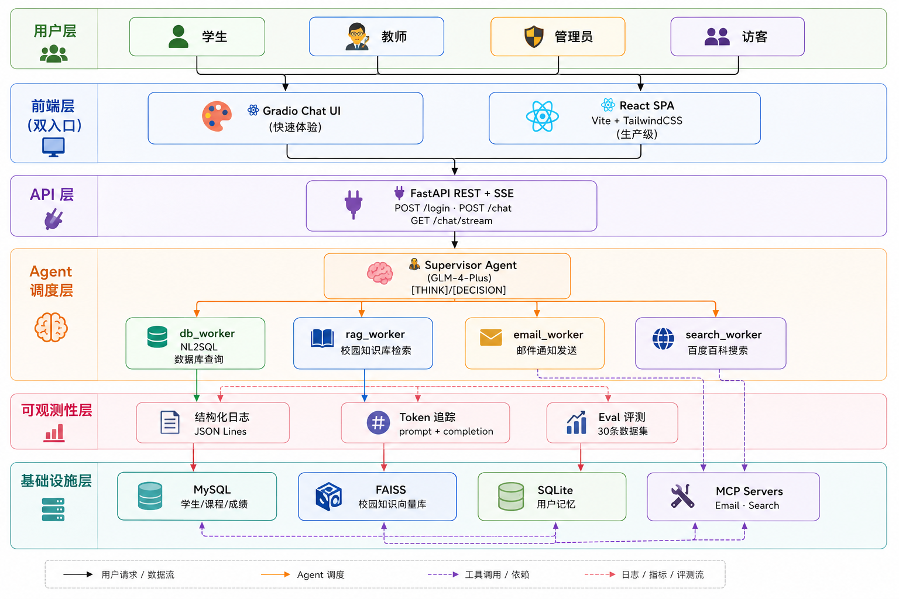

# Smart Campus AI —— 基于 Multi-Agent 协作的智慧校园智能助手

<p align="center">
  
  
  
  
  
  
  
  
  
  
  
  
</p>

---

## 项目简介

Smart Campus AI 是一个基于 **LangGraph + 智谱 GLM-4-Plus** 构建的多 Agent 协作系统，采用 **Supervisor-Worker 架构**，为高校师生提供自然语言驱动的校园信息服务。系统整合了数据库查询（NL2SQL）、RAG 知识库检索、邮件自动化通知、外部搜索引擎等能力，并通过 RBAC 权限模型实现学生/教师/管理员三级访问控制。

提供 **双前端** 入口：Gradio 轻量 Chat UI（快速体验）和 **React + Vite + TailwindCSS** 现代化 SPA（生产级体验），后端统一通过 FastAPI 提供 RESTful API + SSE 流式接口。

### 核心亮点

- **Supervisor-Worker 多 Agent 协作**：Supervisor 智能分派任务给 db_worker、rag_worker、email_worker、search_worker 四个专业 Worker，推理链透明可追溯
- **NL2SQL 自然语言转 SQL**：用户用中文提问，系统自动生成安全的 SELECT 查询，双重安全校验（关键词黑名单 + 表级白名单）
- **FAISS + RAG 校园知识库**：本地向量检索请假流程、奖学金政策、课程安排等校园制度，检索延迟 < 100ms
- **RBAC 精细化权限**：学生只能查自己的成绩，教师可查授课班级，管理员拥有全局权限。10 项 RBAC 测试全部通过
- **LLM 推理链透明化**：前端 Debug 面板实时展示 Supervisor 的 [THINK]/[DECISION] 思维链
- **流式输出**：基于 LangGraph `astream_events` + FastAPI SSE 实现流式推送，Agent "边想边做" 全程可见
- **结构化日志 + Token 追踪**：JSON 格式日志 + token 用量统计，支持多 Agent 系统可观测性
- **MCP 协议支持**：邮件发送和搜索引擎工具通过 MCP (Model Context Protocol) stdio 服务暴露，支持工具标准化集成
- **用户长期记忆**：SQLite 持久化用户偏好与上下文，支持跨会话个性化体验

---

## 评测体系

### Eval 数据集：30 条多场景用例

覆盖 5 个类别（database / knowledge / search / casual / rbac），4 种角色（admin / teacher / student / guest）：

| 指标 | 数值 | 说明 |
|------|------|------|
| Supervisor 路由准确率 | **100.0%** | 30/30 条正确分派到对应 Worker |
| RBAC 权限拦截率 | **100%** | Guest→db_worker、Student→email 等全部正确拦截 |
| RAG 关键词召回率 | **83.3%** | FAISS top-3 检索命中预期关键词 |
| SQL 安全审计通过率 | **100%** | INSERT/DELETE/DROP/ALTER 等 10 种攻击模式全部拦截 |

### 测试覆盖

| 测试文件 | 测试内容 | 用例数 |
|----------|----------|--------|
| `tests/test_sql_safety.py` | SQL 注入防护：DROP/INSERT/DELETE/ALTER/TRUNCATE/CREATE/EXEC + 表白名单 | 13 |
| `tests/test_rbac.py` | 权限校验：admin/teacher/student/guest 四角色 + 数据范围 | 10 |
| `tests/test_supervisor.py` | Supervisor 路由：[THINK]/[DECISION] 解析 + fallback 兼容 | 11 |
| `tests/test_rag.py` | RAG 检索：FAISS 索引存在性 + 空输入 + 关键词命中 | 6 |
| `tests/test_db.py` | 数据库连接与基础查询：MySQL 连通性 + 数据表读写验证 | 1 |

运行方式：
```bash
python tests/test_sql_safety.py    # SQL 安全审计测试
python tests/test_rbac.py          # RBAC 权限测试
python tests/test_supervisor.py    # Supervisor 路由测试
python tests/test_rag.py           # RAG 检索测试
python tests/test_db.py            # 数据库连接测试
python tests/run_eval.py           # 全量 Eval 评测（含 RAG 实时打分）
python tests/run_eval_v2.py        # 增强版 Eval：LLM-as-Judge 语义打分
```

---

## 系统架构

### 整体架构图


### 数据流

```
用户输入 → FastAPI → Supervisor 分析意图 ([THINK])
    → 分派到对应 Worker ([DECISION])
    → Worker 调用工具执行
    → 结果汇总 → LLM 生成自然语言回答
    → SSE 流式推送回前端
    → 前端 Debug 面板展示推理链
```

---

## 技术栈

| 组件 | 技术选型 | 说明 |
|------|----------|------|
| LLM | **智谱 GLM-4-Plus** | 多 Agent 调度 + NL2SQL 生成 + 自然语言应答 |
| Agent 框架 | **LangGraph** | StateGraph 状态机编排多 Agent 协作 |
| 后端 API | **FastAPI** | RESTful 接口 + SSE 流式 + CORS |
| 向量检索 | **FAISS** | 本地向量库，检索延迟 < 100ms |
| 数据库 | **MySQL** | 学生/课程/成绩/教师结构化数据 |
| 记忆管理 | **SQLite + LangGraph Checkpointer** | 多轮对话持久化上下文 + 用户长期记忆 |
| NL2SQL | **LLM Prompt Engineering** | 自然语言转安全 SQL |
| 权限模型 | **RBAC** | 学生/教师/管理员三级访问控制 |
| 前端 (轻量) | **Gradio** | 快速构建 Chat UI（Streaming + Debug 面板） |
| 前端 (生产) | **React 19 + Vite + TailwindCSS 4** | 现代化 SPA，Login/Chat/Debug 页面分离 |
| 前端路由 | **React Router v7** | 登录/聊天页面路由 |
| 邮件 | **SMTP** | 自动化通知邮件 |
| 搜索引擎 | **百度百科** | 外部知识补充 |
| 工具协议 | **MCP (Model Context Protocol)** | stdio 标准化工具暴露 |
| 流式输出 | **LangGraph astream_events** | SSE 实时推送 Agent 执行进度 |
| 可观测性 | **结构化日志 + Token 追踪** | JSON Lines 日志 + prompt/completion token 统计 |
| 测试/评测 | **30 条 Eval 数据集 + 5 套测试** | 路由准确率、RBAC、RAG、SQL 安全、DB 连接 |

---

## 项目结构

```
smart-campus-ai/
├── agents/                 # Agent 核心层
│   ├── supervisor.py       # Supervisor 调度器 + StateGraph + Token追踪 + 结构化日志
│   └── parsing.py          # [THINK]/[DECISION] 输出解析（纯函数，可单测）
├── api/                    # FastAPI 后端 API
│   ├── main.py             # 路由：/login、/chat、/chat/stream + Session 管理
│   └── schemas.py          # Pydantic 请求/响应模型
├── config/                 # 配置
│   └── settings.py         # 环境变量 + 常量（兼容 Docker 大写 KEY）
├── database/               # 数据库层
│   ├── db.py               # MySQL 连接 + SQL 安全审计（14条安全规则）
│   ├── init.sql            # 表结构 DDL
│   ├── init_db.py          # 数据初始化脚本
│   └── sql_generator.py    # NL2SQL 生成器
├── rag/                    # RAG 知识库
│   ├── build_vector.py     # 向量库构建脚本
│   ├── knowledge.txt       # 校园知识文档（7大类）
│   └── vectorstore/        # FAISS 索引文件
├── tools/                  # 工具层
│   ├── db_tool.py          # 数据库查询工具（RBAC 集成）
│   ├── rag_tool.py         # RAG 检索工具
│   ├── email_tool.py       # 邮件发送工具
│   └── baidu_tool.py       # 百度搜索工具
├── auth/                   # 认证授权
│   └── auth.py             # RBAC 登录 + 4角色权限矩阵
├── memory/                 # 用户长期记忆
│   ├── db.py               # SQLite 连接 + 表初始化
│   ├── memory_store.py     # 记忆存取（store_fact / recall / forget）
│   └── profile.py          # 用户画像管理
├── mcp_servers/            # MCP 协议工具服务
│   ├── email_server.py     # MCP stdio 邮件发送服务
│   └── search_server.py    # MCP stdio 搜索引擎服务
├── ui/                     # UI 层（Gradio 入口）
│   └── gradio_ui.py        # Gradio Web 界面（Streaming + Debug面板）
├── frontend/               # React 前端
│   ├── src/
│   │   ├── pages/
│   │   │   ├── Login.jsx   # 登录页（角色选择 + 表单）
│   │   │   └── Chat.jsx    # 聊天页（对话 + Debug 面板）
│   │   ├── components/
│   │   │   ├── ChatMessage.jsx  # 消息气泡组件
│   │   │   └── DebugPanel.jsx   # Supervisor 推理链面板
│   │   ├── api.js          # FastAPI 接口封装
│   │   ├── App.jsx         # React Router 路由配置
│   │   ├── main.jsx        # React 入口
│   │   └── index.css       # TailwindCSS + 全局样式
│   ├── index.html          # HTML 模板
│   ├── package.json        # Node.js 依赖配置
│   └── vite.config.js      # Vite 构建配置（proxy 支持环境变量）
├── utils/                  # 工具
│   └── logger.py           # 结构化 JSON 日志 + AgentLogger
├── tests/                  # 测试与评测
│   ├── test_sql_safety.py  # SQL 安全审计测试（14条）
│   ├── test_rbac.py        # RBAC 权限测试（10条）
│   ├── test_supervisor.py  # Supervisor 路由测试（11条）
│   ├── test_rag.py         # RAG 检索测试（6条）
│   ├── test_db.py          # 数据库连接测试
│   ├── run_eval.py         # 全量 Eval 评测脚本（规则打分）
│   └── run_eval_v2.py      # 增强版 Eval 评测（LLM-as-Judge 语义打分）
├── data/                   # 数据
│   ├── eval_set.json       # 30条多场景评测数据集
│   ├── users.json          # 用户账号与权限配置
│   └── agent_memory.db     # SQLite 用户长期记忆
├── logs/                   # 日志输出
│   └── agent.jsonl         # 结构化 JSON Lines 日志
├── app.py                  # 应用入口（Gradio 模式）
├── requirements.txt        # Python 依赖
├── package-lock.json       # Node.js 依赖锁文件
├── Dockerfile.backend      # FastAPI 后端镜像
├── Dockerfile.frontend     # React 前端镜像
├── docker-compose.yml      # 容器编排（MySQL + Backend + Frontend）
├── .dockerignore           # Docker 构建排除文件
└── .env                    # 环境配置
```

---

## 快速开始


### 0. Docker 一键启动（推荐）

```bash
# 前置条件：
#   1. 启动 Docker Desktop（状态变为 Running）
#   2. 项目根目录 .env 已填写 MYSQL_PASSWORD / MYSQL_DB / ZHIPUAI_API_KEY

# 首次启动（需要构建镜像，耗时几分钟）：
docker compose up -d --build

# 之后启动 / 停止：
docker compose up -d
docker compose down
# 清理全部数据（重建数据库）：
docker compose down -v

# 查看启动日志：
docker compose logs -f backend
```

> 服务说明：MySQL → `localhost:3307` | FastAPI → `localhost:8000` | React → `localhost:5173`
>
> 代码修改后自动热重载，无需手动重启。
>
> 首次启动会自动：拉取 MySQL 8.0 / Python 3.10 / Node 22 镜像 → 执行 `database/init.sql` 初始化数据库 → 安装前后端依赖并启动。

### 1. 环境配置（手动安装）


编辑 `.env` 文件：

```env
ZHIPUAI_API_KEY=你的智谱API密钥
MYSQL_HOST=127.0.0.1
MYSQL_USER=root
MYSQL_PASSWORD=你的数据库密码
MYSQL_DB=smart_campus
EMAIL_USER=你的邮箱@qq.com
EMAIL_PASSWORD=你的SMTP授权码
```

### 2. 后端安装 & 初始化

```bash
pip install -r requirements.txt
cd database && python init_db.py && cd ..
cd rag && python build_vector.py && cd ..
```

### 3. 启动后端

**Gradio 模式（快速体验）：**
```bash
python app.py
```
浏览器访问 `http://127.0.0.1:7860`

**FastAPI 模式（配合 React 前端）：**
```bash
uvicorn api.main:app --host 0.0.0.0 --port 8000 --reload
```
API 文档访问 `http://127.0.0.1:8000/docs`

### 4. 启动 React 前端

```bash
cd frontend
npm install
npm run dev
```
浏览器访问 `http://localhost:5173`

### 5. 运行测试

```bash
python tests/test_sql_safety.py    # SQL 安全
python tests/test_rbac.py          # RBAC 权限
python tests/test_supervisor.py    # Supervisor 路由
python tests/test_rag.py           # RAG 检索
python tests/test_db.py            # 数据库连接
python tests/run_eval.py           # 全量 Eval（规则打分）
python tests/run_eval_v2.py        # 增强版 Eval（LLM-as-Judge）
```

### 测试账号

| 角色 | 用户名 | 密码 |
|------|--------|------|
| 管理员 | `admin` | `admin123` |
| 教师 | `teacher_wang` | `teacher123` |
| 学生 | `student_zhang` | `student123` |
| 访客 | 点击 Guest 按钮 | - |

---

## RBAC 权限矩阵

| 操作 | 学生 | 教师 | 管理员 | 访客 |
|------|:----:|:----:|:------:|:----:|
| 查自己成绩 | ✅ | ✅ | ✅ | ❌ |
| 查他人成绩 | ❌ | ✅(仅授课班级) | ✅ | ❌ |
| 查全校统计 | ❌ | ❌ | ✅ | ❌ |
| RAG 知识库 | ✅ | ✅ | ✅ | ✅ |
| 发邮件 | ❌ | ✅ | ✅ | ❌ |
| 百度搜索 | ✅ | ✅ | ✅ | ✅ |

---

## License

MIT License