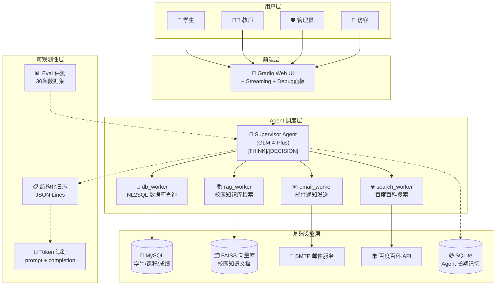
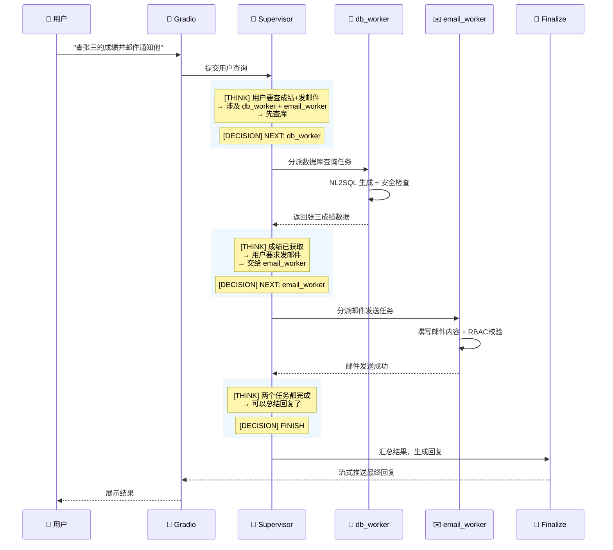

# Smart Campus AI —— 基于 Multi-Agent 协作的智慧校园智能助手

<p align="center">
  
  
  
  
  
  
  
  
  
  
</p>

---

## 项目简介

Smart Campus AI 是一个基于 **LangGraph + 智谱 GLM-4-Plus** 构建的多 Agent 协作系统，采用 **Supervisor-Worker 架构**，为高校师生提供自然语言驱动的校园信息服务。系统整合了数据库查询（NL2SQL）、RAG 知识库检索、邮件自动化通知、外部搜索引擎等能力，并通过 RBAC 权限模型实现学生/教师/管理员三级访问控制。

### 核心亮点

- **Supervisor-Worker 多 Agent 协作**：Supervisor 智能分派任务给 db_worker、rag_worker、email_worker、search_worker 四个专业 Worker，推理链透明可追溯
- **NL2SQL 自然语言转 SQL**：用户用中文提问，系统自动生成安全的 SELECT 查询，双重安全校验（关键词黑名单 + 表级白名单）
- **FAISS + RAG 校园知识库**：本地向量检索请假流程、奖学金政策、课程安排等校园制度，检索延迟 < 100ms
- **RBAC 精细化权限**：学生只能查自己的成绩，教师可查授课班级，管理员拥有全局权限。10 项 RBAC 测试全部通过
- **LLM 推理链透明化**：前端 Debug 面板实时展示 Supervisor 的 [THINK]/[DECISION] 思维链
- **流式输出**：基于 LangGraph `astream_events` + Gradio 生成器实现 SSE 流式推送，Agent "边想边做" 可见
- **结构化日志 + Token 追踪**：JSON 格式日志 + token 用量统计，支持多 Agent 系统可观测性

---

## 评测体系

### Eval 数据集：30 条多场景用例

覆盖 5 个类别（database / knowledge / search / casual / rbac），4 种角色（admin / teacher / student / guest）：

| 指标 | 数值 | 说明 |
|------|------|------|
| Supervisor 路由准确率 | **100.0%** | 30/30 条正确分派到对应 Worker |
| RBAC 权限拦截率 | **100%** | Guest→db_worker、Student→email 等全部正确拦截 |
| RAG 关键词召回率 | **83.3%** | FAISS top-3 检索命中预期关键词 |
| SQL 安全审计通过率 | **100%** | INSERT/DELETE/DROP/ALTER 等 10 种攻击模式全部拦截 |

### 测试覆盖

| 测试文件 | 测试内容 | 用例数 |
|----------|----------|--------|
| `tests/test_sql_safety.py` | SQL 注入防护：DROP/INSERT/DELETE/ALTER/TRUNCATE/CREATE/EXEC + 表白名单 | 14 |
| `tests/test_rbac.py` | 权限校验：admin/teacher/student/guest 四角色 + 数据范围 | 10 |
| `tests/test_supervisor.py` | Supervisor 路由：[THINK]/[DECISION] 解析 + fallback 兼容 | 11 |
| `tests/test_rag.py` | RAG 检索：FAISS 索引存在性 + 空输入 + 关键词命中 | 6 |

运行方式：
```bash
python tests/test_sql_safety.py    # SQL 安全审计测试
python tests/test_rbac.py          # RBAC 权限测试
python tests/test_supervisor.py    # Supervisor 路由测试
python tests/test_rag.py           # RAG 检索测试
python tests/run_eval.py           # 全量 Eval 评测（含 RAG 实时打分）
```

---

## 系统架构

### 整体架构图



### Agent 协同流程（时序图）



---

## 技术选型说明

### 为什么 Supervisor 模式而不是单 ReAct？

| 对比维度 | 单 ReAct Agent | Supervisor-Worker（本项目） |
|----------|---------------|---------------------------|
| 任务编排 | 单一 LLM 思考→行动循环 | Supervisor 集中调度，Worker 专注执行 |
| 并发能力 | 串行推理，一次一个工具 | Supervisor 可并行分发多个 Worker |
| 可观测性 | 黑盒，难以追踪决策过程 | [THINK]/[DECISION] 显式输出推理链 |
| 权限控制 | 硬编码在 Prompt 中 | 每个 Worker 独立鉴权，RBAC 精细化 |
| 扩展性 | 新增工具需修改 Prompt | 新增 Worker 即插即用，零侵入 |

### 为什么 FAISS 而不是 Pinecone/Chroma？

| 对比维度 | FAISS（本项目） | Pinecone | Chroma |
|----------|----------------|----------|--------|
| 部署方式 | 纯本地，零网络依赖 | 云服务，需联网 | 本地/嵌入式 |
| 性能 | GPU 加速，十亿级向量毫秒检索 | 云端扩展 | 中等规模 |
| 成本 | 免费，无额度限制 | 按查询量计费 | 免费 |
| 选型理由 | ✅ 校园知识文档量不大，本地 FAISS 完全够用 | ❌ | ❌ |

### 为什么智谱 GLM 而不是直接调 OpenAI？

| 对比维度 | 智谱 GLM-4-Plus（本项目） | OpenAI GPT-4o |
|----------|-------------------------|---------------|
| API 可用性 | 国内直连，零延迟 | 需代理，不稳定 |
| 中文能力 | 原生中文优化 | 通用多语言 |
| 成本 | 0.05/1K tokens | $0.005/1K tokens |
| 数据合规 | 国内服务器，合规无忧 | 境外传输有风险 |

---

## 技术栈

| 类别 | 技术 | 用途 |
|------|------|------|
| Agent 框架 | **LangGraph** | StateGraph 构建 Supervisor-Worker 协同图 |
| LLM | **智谱 GLM-4-Plus** | 核心推理引擎（Supervisor 决策 + Finalize 总结） |
| 向量数据库 | **FAISS** | 校园知识库本地语义检索 |
| 嵌入模型 | **sentence-transformers/all-MiniLM-L6-v2** | 文档向量化编码 |
| 数据库 | **MySQL** | 学生/课程/成绩/教师结构化数据 |
| 记忆管理 | **SQLite + LangGraph Checkpointer** | 多轮对话持久化上下文 |
| NL2SQL | **LLM Prompt Engineering** | 自然语言转安全 SQL |
| 权限模型 | **RBAC** | 学生/教师/管理员三级访问控制 |
| 前端 | **Gradio** | 快速构建 Chat UI（Streaming + Debug面板） |
| 邮件 | **SMTP** | 自动化通知邮件 |
| 搜索引擎 | **百度百科** | 外部知识补充 |
| 流式输出 | **LangGraph astream_events** | SSE 实时推送 Agent 执行进度 |
| 可观测性 | **结构化日志 + Token 追踪** | JSON Lines 日志 + prompt/completion token 统计 |
| 测试/评测 | **30 条 Eval 数据集 + 4 套测试** | 路由准确率、RBAC、RAG、SQL 安全 |

---

## 项目结构

```
smart-campus-ai/
├── agents/                 # Agent 核心层
│   ├── supervisor.py       # Supervisor 调度器 + StateGraph + Token追踪 + 结构化日志
│   ├── nodes.py            # 节点函数（分类/规划/守卫/执行/反思/生成）
│   ├── state.py            # Agent 状态定义
│   └── campus_agent.py     # 旧版单 Agent（保留兼容）
├── config/                 # 配置
│   ├── settings.py         # 环境变量 + 常量
│   └── prompt.py           # System Prompt + 意图分类 Prompt
├── database/               # 数据库层
│   ├── db.py               # MySQL 连接 + SQL 安全审计（14条安全规则）
│   ├── init.sql            # 表结构 DDL
│   ├── init_db.py          # 数据初始化脚本
│   └── sql_generator.py    # NL2SQL 生成器
├── rag/                    # RAG 知识库
│   ├── build_vector.py     # 向量库构建脚本
│   ├── knowledge.txt       # 校园知识文档（7大类）
│   └── vectorstore/        # FAISS 索引文件
├── tools/                  # 工具层
│   ├── db_tool.py          # 数据库查询工具（RBAC 集成）
│   ├── rag_tool.py         # RAG 检索工具
│   ├── email_tool.py       # 邮件发送工具
│   └── baidu_tool.py       # 百度搜索工具
├── auth/                   # 认证授权
│   └── auth.py             # RBAC 登录 + 4角色权限矩阵
├── ui/                     # UI 层
│   └── gradio_ui.py        # Gradio Web 界面（Streaming + Debug面板）
├── utils/                  # 工具
│   └── logger.py           # 结构化 JSON 日志 + AgentLogger
├── tests/                  # 测试与评测
│   ├── test_sql_safety.py  # SQL 安全审计测试（14条）
│   ├── test_rbac.py        # RBAC 权限测试（10条）
│   ├── test_supervisor.py  # Supervisor 路由测试（11条）
│   ├── test_rag.py         # RAG 检索测试（6条）
│   └── run_eval.py         # 全量 Eval 评测脚本
├── data/                   # 数据
│   ├── eval_set.json       # 30条多场景评测数据集
│   └── agent_memory.db     # SQLite 长期记忆
├── logs/                   # 日志输出
│   └── agent.jsonl         # 结构化 JSON Lines 日志
├── app.py                  # 应用入口
├── requirements.txt        # Python 依赖
└── .env                    # 环境配置
```

---

## 快速开始

### 1. 环境配置

编辑 `.env` 文件：

```env
zhipuai_api_key=你的智谱API密钥
mysql_host=127.0.0.1
mysql_user=root
mysql_password=你的数据库密码
mysql_db=smart_campus
email_user=你的邮箱@qq.com
email_password=你的SMTP授权码
```

### 2. 安装 & 初始化

```bash
pip install -r requirements.txt
cd database && python init_db.py && cd ..
cd rag && python build_vector.py && cd ..
```

### 3. 启动

```bash
python app.py
```

浏览器访问 `http://127.0.0.1:7860`

### 4. 运行测试

```bash
python tests/test_sql_safety.py    # SQL 安全
python tests/test_rbac.py          # RBAC 权限
python tests/test_supervisor.py    # Supervisor 路由
python tests/test_rag.py           # RAG 检索
python tests/run_eval.py           # 全量 Eval
```

### 测试账号

| 角色 | 用户名 | 密码 |
|------|--------|------|
| 管理员 | `admin` | `admin123` |
| 教师 | `teacher_wang` | `teacher123` |
| 学生 | `student_zhang` | `student123` |
| 访客 | 点击 Guest 按钮 | - |

---

## RBAC 权限矩阵

| 操作 | 学生 | 教师 | 管理员 | 访客 |
|------|:----:|:----:|:------:|:----:|
| 查自己成绩 | ✅ | ✅ | ✅ | ❌ |
| 查他人成绩 | ❌ | ✅(仅授课班级) | ✅ | ❌ |
| 查全校统计 | ❌ | ❌ | ✅ | ❌ |
| RAG 知识库 | ✅ | ✅ | ✅ | ✅ |
| 发邮件 | ❌ | ✅ | ✅ | ❌ |
| 百度搜索 | ✅ | ✅ | ✅ | ✅ |

---

## License

MIT License
